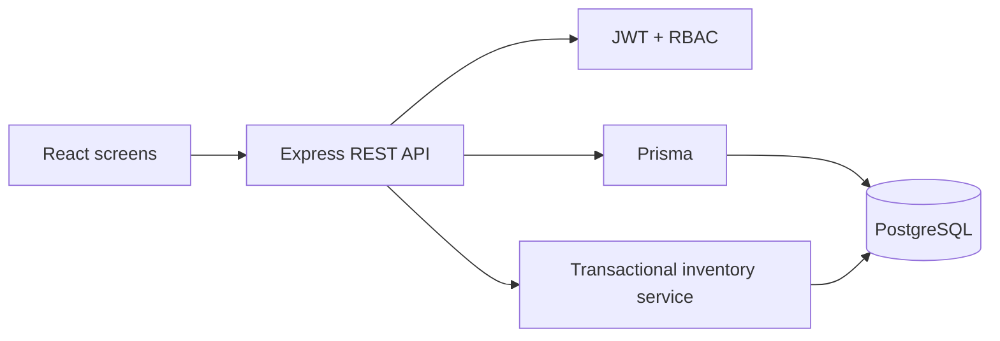

# Architecture

The application uses a React client and an Express REST API. Prisma maps PostgreSQL tables to typed backend queries. The browser stores only the JWT and user summary; authorization is repeated on the API using `authenticate` and `requireRole` middleware.

