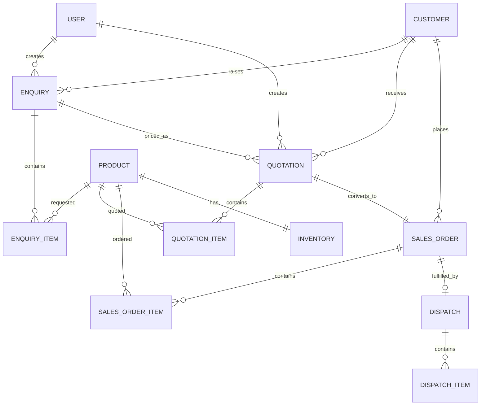

# Database Design

Core tables are `User`, `Customer`, `Product`, `Inventory`, `Enquiry`, `EnquiryItem`, `Quotation`, `QuotationItem`, `SalesOrder`, `SalesOrderItem`, `Dispatch`, and `DispatchItem`.

Foreign keys preserve the traceable chain:

`Customer -> Enquiry -> Quotation -> SalesOrder -> Dispatch`

Products connect to enquiry, quotation, order, and dispatch line items. Inventory is one-to-one with Product and has database-backed quantities. Unique constraints prevent duplicate emails, product codes, enquiry numbers, quotation numbers, order numbers, dispatch numbers, and quotation-to-order conversion.

Available quantity is calculated as:

`physicalQty - reservedQty - damagedQty`

